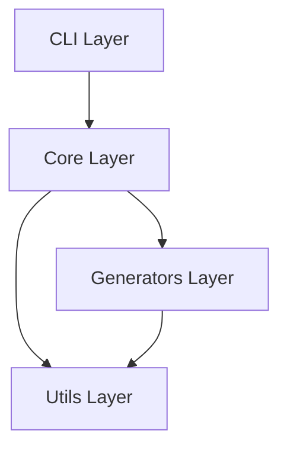

# 👩‍💻 開発者ガイド

## 概要

このガイドは、Auto Diagram Generator (ADG)の開発に参加する方向けの包括的なドキュメントです。

## 開発環境のセットアップ

### 必要な環境

- Python 3.9以上
- Git
- 仮想環境管理ツール（venv, virtualenv, conda等）

### 初期セットアップ

```bash
# リポジトリをフォーク＆クローン
git clone https://github.com/[your-username]/Auto_Diagram_Generator.git
cd Auto_Diagram_Generator

# 仮想環境を作成
python -m venv venv
source venv/bin/activate  # Windows: venv\Scripts\activate

# 開発用インストール
pip install -e ".[dev]"

# pre-commitフックの設定（今後実装）
pre-commit install
```

## プロジェクト構造

```
Auto_Diagram_Generator/
├── src/adg/               # ソースコード
│   ├── core/             # コア機能
│   │   ├── analyzer.py   # コード解析エンジン
│   │   ├── detector.py   # 図判定ロジック
│   │   └── results.py    # 結果型定義
│   ├── generators/       # 図生成器
│   │   ├── mermaid.py   # Mermaid生成
│   │   ├── plantuml.py  # PlantUML生成（未実装）
│   │   └── drawio.py    # Draw.io生成（未実装）
│   ├── utils/           # ユーティリティ
│   │   ├── security.py  # セキュリティ機能
│   │   └── validation.py # バリデーション
│   └── cli/             # CLIインターフェース
│       └── command.py   # CLIコマンド定義
├── tests/               # テストコード
├── docs/                # ドキュメント
└── config/              # 設定ファイル
```

## アーキテクチャ

### レイヤード設計



### 主要コンポーネント

#### 1. Core Layer（コア層）

**責任：** ビジネスロジックとコード解析

- `analyzer.py`: 言語別のコード解析器
- `detector.py`: 必要な図の自動判定
- `results.py`: 型安全な結果処理

#### 2. Generators Layer（生成層）

**責任：** 各フォーマットでの図生成

- `mermaid.py`: Mermaid形式
- `plantuml.py`: PlantUML形式
- `drawio.py`: Draw.io形式

#### 3. Utils Layer（ユーティリティ層）

**責任：** 共通機能とセキュリティ

- `security.py`: パス検証、サニタイゼーション
- `validation.py`: 入力検証

## コーディング規約

### Pythonスタイルガイド

PEP 8に準拠し、以下のツールで自動化：

```bash
# フォーマット
black src/ tests/

# リント
flake8 src/ tests/

# 型チェック
mypy src/
```

### 設定（pyproject.toml）

```toml
[tool.black]
line-length = 100
target-version = ['py39']

[tool.isort]
profile = "black"
line_length = 100

[tool.mypy]
python_version = "3.9"
strict = true
```

### 命名規則

```python
# クラス名: PascalCase
class CodeAnalyzer:
    pass

# 関数名: snake_case
def analyze_code():
    pass

# 定数: UPPER_SNAKE_CASE
MAX_FILE_SIZE = 100

# プライベート: 先頭にアンダースコア
def _internal_function():
    pass
```

## 新機能の追加

### 1. 新しい図種の追加

```python
# 1. generators/new_diagram.py を作成
class NewDiagramGenerator:
    def generate(self, analysis_result):
        # 実装
        pass

# 2. detector.py に判定ロジックを追加
def _detect_new_diagram(self, analysis):
    # 判定ロジック
    return DiagramRecommendation(...)

# 3. CLIコマンドに追加
# cli/command.py で対応
```

### 2. 新しい言語サポート

```python
# 1. analyzer.py に新しいAnalyzerクラスを追加
class JavaScriptAnalyzer(CodeAnalyzer):
    def analyze(self):
        # JavaScript解析実装
        pass

# 2. ProjectAnalyzerに登録
self.analyzers = {
    '.py': PythonAnalyzer,
    '.js': JavaScriptAnalyzer,  # 追加
}
```

## テスト

### テスト構造

```
tests/
├── unit/           # 単体テスト
│   ├── test_analyzer.py
│   ├── test_detector.py
│   └── test_generators.py
├── integration/    # 統合テスト
│   └── test_cli.py
└── fixtures/       # テストデータ
    └── sample_code/
```

### テストの実行

```bash
# すべてのテスト
pytest

# カバレッジ付き
pytest --cov=src --cov-report=html

# 特定のテスト
pytest tests/unit/test_analyzer.py

# マーカー付きテスト
pytest -m "not slow"
```

### テストの書き方

```python
import pytest
from adg.core.analyzer import PythonAnalyzer

class TestPythonAnalyzer:
    @pytest.fixture
    def sample_file(self, tmp_path):
        """テスト用ファイル作成"""
        code = """
        class TestClass:
            def method(self):
                pass
        """
        file = tmp_path / "test.py"
        file.write_text(code)
        return file
    
    def test_analyze_class(self, sample_file):
        """クラス解析のテスト"""
        analyzer = PythonAnalyzer(str(sample_file))
        result = analyzer.analyze()
        
        assert result.success
        assert len(result.data['classes']) == 1
        assert result.data['classes'][0]['name'] == 'TestClass'
```

## デバッグ

### ログ設定

```python
from loguru import logger

# デバッグレベルの設定
logger.add("debug.log", level="DEBUG")

# 使用例
logger.debug("詳細情報")
logger.info("通常情報")
logger.warning("警告")
logger.error("エラー")
```

### デバッグモード

```bash
# 環境変数で有効化
export ADG_DEV_MODE=1
export ADG_LOG_LEVEL=DEBUG

# 実行
adg analyze --verbose
```

## パフォーマンス最適化

### プロファイリング

```python
import cProfile
import pstats

# プロファイリング実行
profiler = cProfile.Profile()
profiler.enable()

# 処理実行
analyze_project()

profiler.disable()
stats = pstats.Stats(profiler)
stats.sort_stats('cumulative')
stats.print_stats(10)
```

### 最適化のポイント

1. **大規模ファイルの処理**
   - ストリーミング処理
   - チャンク単位の解析

2. **並列処理**
   - `multiprocessing`でファイル並列解析
   - `asyncio`で非同期I/O

3. **キャッシング**
   - `diskcache`で結果キャッシュ
   - メモイゼーション

## リリースプロセス

### バージョニング

セマンティックバージョニング（SemVer）に準拠：

- **MAJOR**: 後方互換性のない変更
- **MINOR**: 後方互換性のある機能追加
- **PATCH**: 後方互換性のあるバグ修正

### リリース手順

```bash
# 1. バージョン更新
# setup.py, __init__.py を更新

# 2. 変更履歴更新
# CHANGELOG.md を更新

# 3. テスト実行
pytest
tox  # 複数Python環境でテスト

# 4. タグ作成
git tag -a v0.2.0 -m "Release version 0.2.0"
git push origin v0.2.0

# 5. パッケージビルド
python -m build

# 6. PyPIへアップロード（今後）
twine upload dist/*
```

## トラブルシューティング

### よくある問題

#### インポートエラー

```bash
# 開発モードでインストール
pip install -e .

# または環境変数設定
export ADG_DEV_MODE=1
```

#### 型チェックエラー

```bash
# スタブファイル生成
stubgen -p adg -o stubs/
```

## コントリビューション

### プルリクエストのプロセス

1. **Issue作成**: まず議論
2. **ブランチ作成**: `feature/`, `fix/`, `docs/`
3. **実装**: テスト付きで
4. **PR作成**: テンプレート使用
5. **レビュー**: CI通過とレビュー承認
6. **マージ**: squash and merge

### コミットメッセージ

```
type(scope): subject

body

footer
```

例：
```
feat(analyzer): Add JavaScript support

- Implement JavaScriptAnalyzer class
- Add tree-sitter-javascript parser
- Update ProjectAnalyzer registration

Closes #123
```

### タイプ一覧

- `feat`: 新機能
- `fix`: バグ修正
- `docs`: ドキュメント
- `style`: フォーマット
- `refactor`: リファクタリング
- `test`: テスト
- `chore`: ビルド、補助ツール

## リソース

### 内部ドキュメント

- [API仕様](API_SPECIFICATION.md)
- [アーキテクチャ](ARCHITECTURE.md)
- [セキュリティガイド](SECURITY.md)

### 外部リソース

- [Python AST](https://docs.python.org/3/library/ast.html)
- [Tree-sitter](https://tree-sitter.github.io/)
- [Mermaid](https://mermaid-js.github.io/)
- [PlantUML](https://plantuml.com/)

## サポート

### 質問・議論

- GitHub Discussions
- Issue作成（バグ報告）
- Pull Request（機能提案）

### 連絡先

- GitHub: [@KEIEI-NET](https://github.com/KEIEI-NET)

---

最終更新: 2024年1月16日