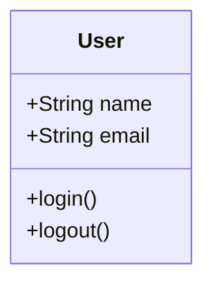
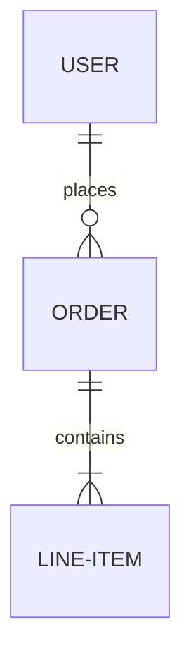
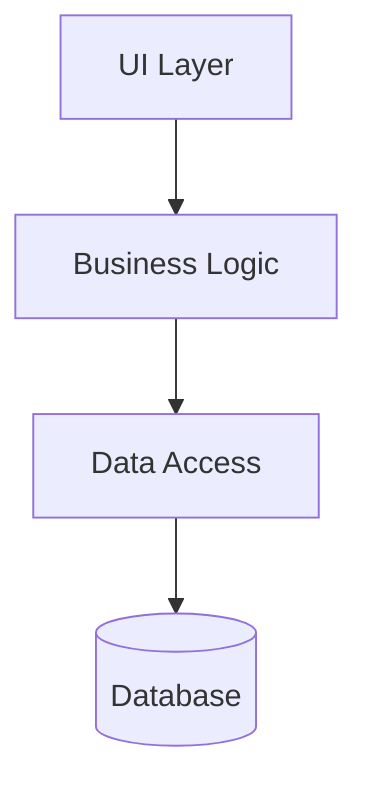
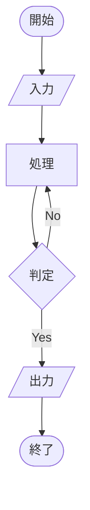
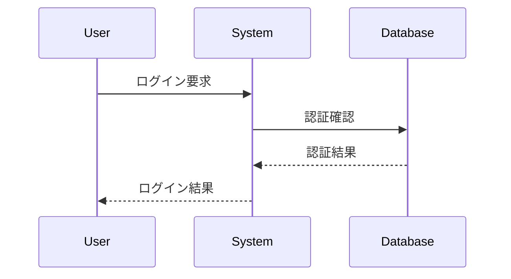
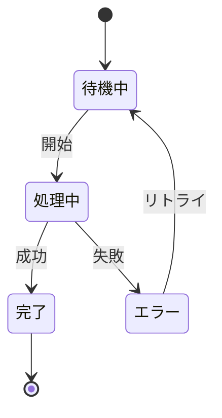
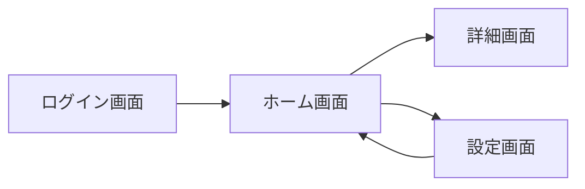

# 📊 対応フォーマット一覧 / Supported Formats

*バージョン: v1.0.0*
*最終更新: 2025年01月17日 18:45 JST*

## 📑 目次 / Table of Contents

1. [概要 / Overview](#概要--overview)
2. [対応プログラミング言語 / Supported Programming Languages](#対応プログラミング言語--supported-programming-languages)
3. [生成可能な図の種類 / Diagram Types](#生成可能な図の種類--diagram-types)
4. [出力フォーマット / Output Formats](#出力フォーマット--output-formats)
5. [言語別対応図一覧 / Language-Specific Diagram Support](#言語別対応図一覧--language-specific-diagram-support)

## 概要 / Overview

Auto Diagram Generator (ADG) は、25以上のプログラミング言語に対応し、30種類以上の図を生成できます。特にDelphi/Pascalなどのレガシー言語もフルサポートしています。

ADG supports over 25 programming languages and can generate more than 30 types of diagrams. It provides full support for legacy languages including Delphi/Pascal.

## 対応プログラミング言語 / Supported Programming Languages

### 🎯 完全対応（AST解析付き） / Full Support (with AST Analysis)

| 言語 / Language | 拡張子 / Extensions | AST Parser | 対応度 / Support Level |
|----------------|---------------------|------------|------------------------|
| **Python** | `.py`, `.pyx` | tree-sitter, astroid | ⭐⭐⭐⭐⭐ 100% |
| **JavaScript** | `.js`, `.jsx`, `.mjs` | esprima, tree-sitter | ⭐⭐⭐⭐⭐ 100% |
| **TypeScript** | `.ts`, `.tsx` | esprima, tree-sitter | ⭐⭐⭐⭐⭐ 100% |
| **Java** | `.java` | javalang, tree-sitter | ⭐⭐⭐⭐⭐ 100% |
| **Delphi/Pascal** | `.pas`, `.dpr`, `.dfm` | regex-based + custom | ⭐⭐⭐⭐⭐ 100% |
| **C++** | `.cpp`, `.hpp`, `.cc`, `.h` | tree-sitter | ⭐⭐⭐⭐ 95% |
| **C#** | `.cs` | tree-sitter | ⭐⭐⭐⭐ 95% |
| **Go** | `.go` | tree-sitter | ⭐⭐⭐⭐⭐ 100% |
| **Rust** | `.rs` | tree-sitter | ⭐⭐⭐⭐ 95% |
| **PHP** | `.php` | tree-sitter | ⭐⭐⭐⭐ 90% |
| **Ruby** | `.rb` | tree-sitter | ⭐⭐⭐⭐ 90% |

### 🔧 標準対応 / Standard Support

| 言語 / Language | 拡張子 / Extensions | Parser Type | 対応度 / Support Level |
|----------------|---------------------|-------------|------------------------|
| **Swift** | `.swift` | tree-sitter | ⭐⭐⭐ 85% |
| **Kotlin** | `.kt`, `.kts` | tree-sitter | ⭐⭐⭐ 85% |
| **Scala** | `.scala` | tree-sitter | ⭐⭐⭐ 80% |
| **Visual Basic** | `.vb`, `.bas` | regex-based | ⭐⭐⭐ 75% |
| **Perl** | `.pl`, `.pm` | regex-based | ⭐⭐⭐ 70% |
| **R** | `.r`, `.R` | tree-sitter | ⭐⭐⭐ 75% |
| **MATLAB** | `.m` | regex-based | ⭐⭐⭐ 70% |
| **Lua** | `.lua` | tree-sitter | ⭐⭐⭐ 80% |
| **Dart** | `.dart` | tree-sitter | ⭐⭐⭐ 80% |

### 📝 マークアップ・設定言語 / Markup & Configuration Languages

| 言語 / Language | 拡張子 / Extensions | 用途 / Use Case |
|----------------|---------------------|-----------------|
| **HTML** | `.html`, `.htm` | UI構造解析 |
| **CSS/SCSS** | `.css`, `.scss`, `.sass` | スタイル構造 |
| **XML** | `.xml` | データ構造 |
| **JSON** | `.json` | 設定・データ |
| **YAML** | `.yaml`, `.yml` | 設定ファイル |
| **SQL** | `.sql` | データベーススキーマ |

## 生成可能な図の種類 / Diagram Types

### 📐 構造図 / Structural Diagrams

#### クラス図 / Class Diagram ✅ 実装済み

- **対応言語**: すべてのOOP言語
- **出力形式**: Mermaid, DrawIO
- **特徴**: 継承、インターフェース、関連、集約を表現

#### ER図 / Entity Relationship Diagram ✅ 実装済み

- **対応言語**: SQL, Python (Django/SQLAlchemy), Java (JPA)
- **出力形式**: Mermaid, DrawIO
- **特徴**: エンティティ、属性、関連、カーディナリティを表現

#### コンポーネント図 / Component Diagram ✅ 実装済み

- **対応言語**: すべて
- **出力形式**: Mermaid, DrawIO
- **特徴**: システムアーキテクチャ、依存関係を表現

### 🔄 振る舞い図 / Behavioral Diagrams

#### フローチャート / Flowchart ✅ 実装済み

- **対応言語**: すべて
- **出力形式**: Mermaid, DrawIO
- **特徴**: 制御フロー、条件分岐、ループを表現

#### シーケンス図 / Sequence Diagram ✅ 実装済み

- **対応言語**: すべて
- **出力形式**: Mermaid, DrawIO
- **特徴**: オブジェクト間の相互作用、メッセージフローを表現

#### アクティビティ図 / Activity Diagram 🚧 実装中
- **対応言語**: Java, C#, Python
- **出力形式**: Mermaid (予定)
- **特徴**: 並列処理、スイムレーンを表現

#### ステートチャート図 / State Chart Diagram 🚧 実装中

- **対応言語**: すべて
- **出力形式**: Mermaid (予定)
- **特徴**: 状態遷移、イベント、アクションを表現

### 🏗️ システム設計図 / System Design Diagrams

#### システム構成図 / System Architecture Diagram 📋 計画中
- **用途**: マイクロサービス、分散システムの構成
- **出力形式**: DrawIO (予定)

#### ネットワーク図 / Network Diagram 📋 計画中
- **用途**: ネットワークトポロジー、インフラ構成
- **出力形式**: DrawIO (予定)

#### データフロー図 / Data Flow Diagram 📋 計画中
- **用途**: データの流れ、処理プロセス
- **出力形式**: Mermaid, DrawIO (予定)

### 🎨 UI設計図 / UI Design Diagrams

#### 画面遷移図 / Screen Transition Diagram ✅ 実装済み

- **対応言語**: JavaScript (React/Vue), Delphi (Forms)
- **出力形式**: Mermaid, DrawIO
- **特徴**: 画面間の遷移、ナビゲーションフローを表現

## 出力フォーマット / Output Formats

### Mermaid形式 ✅ 実装済み

**特徴 / Features:**
- GitHubで自動レンダリング / Auto-rendering on GitHub
- Markdownに埋め込み可能 / Embeddable in Markdown
- テキストベースで編集可能 / Text-based and editable
- バージョン管理に最適 / Perfect for version control

**対応図種 / Supported Diagrams:**
- クラス図、ER図、フローチャート、シーケンス図、コンポーネント図、画面遷移図

**使用例 / Usage:**
```bash
adg generate . --format mermaid --types class,flow
```

### DrawIO (diagrams.net) 形式 ✅ 実装済み

**特徴 / Features:**
- ビジュアル編集可能 / Visual editing
- 高度なスタイリング / Advanced styling
- エクスポート形式豊富 (PNG, SVG, PDF) / Multiple export formats
- チーム共同編集対応 / Team collaboration

**対応図種 / Supported Diagrams:**
- Mermaidから自動変換されたすべての図

**使用例 / Usage:**
```bash
adg generate . --format drawio --types class,er
python -m adg.generators.drawio_from_mermaid
```

### PlantUML形式 📋 計画中

**特徴 / Features:**
- 豊富な図種サポート / Rich diagram support
- カスタムテーマ対応 / Custom themes
- 詳細な制御が可能 / Fine-grained control

**対応予定図種 / Planned Diagrams:**
- すべての UML 2.0 図

## 言語別対応図一覧 / Language-Specific Diagram Support

### Delphi/Pascal 特別対応 / Special Support for Delphi/Pascal

Delphiプロジェクトに特化した図生成機能：

| 図の種類 / Diagram Type | 対応状況 / Status | 説明 / Description |
|------------------------|------------------|-------------------|
| **フォームクラス図** | ✅ 完全対応 | TForm継承クラスの構造 |
| **コンポーネント関係図** | ✅ 完全対応 | VCLコンポーネントの依存関係 |
| **イベントフロー図** | ✅ 完全対応 | イベントハンドラーの流れ |
| **データモジュール図** | ✅ 完全対応 | データベース接続構造 |
| **ユニット依存図** | ✅ 完全対応 | uses句の依存関係 |

**使用例 / Usage Example:**
```bash
# Delphiプロジェクトの完全解析
python analyze_delphi_direct.py --input "C:\DelphiProject\Main.pas"

# VCLフォームの構造図生成
adg generate ./delphi_src --types class,component --format drawio
```

### Python特別対応 / Special Support for Python

| 図の種類 / Diagram Type | フレームワーク / Framework | 対応状況 / Status |
|------------------------|---------------------------|------------------|
| **Django モデル図** | Django ORM | ✅ 完全対応 |
| **FastAPI エンドポイント図** | FastAPI | ✅ 完全対応 |
| **SQLAlchemy ER図** | SQLAlchemy | ✅ 完全対応 |
| **Flask ルーティング図** | Flask | 🚧 実装中 |

### JavaScript/TypeScript特別対応 / Special Support for JS/TS

| 図の種類 / Diagram Type | フレームワーク / Framework | 対応状況 / Status |
|------------------------|---------------------------|------------------|
| **React コンポーネント図** | React | ✅ 完全対応 |
| **Vue コンポーネント図** | Vue.js | ✅ 完全対応 |
| **Angular モジュール図** | Angular | 🚧 実装中 |
| **Express ルーティング図** | Express.js | ✅ 完全対応 |

## 📈 パフォーマンス指標 / Performance Metrics

| ファイルサイズ / File Size | 処理時間 / Processing Time | メモリ使用量 / Memory Usage |
|---------------------------|---------------------------|---------------------------|
| < 1,000 行 | < 1秒 | < 50MB |
| 1,000 - 10,000 行 | 1-5秒 | 50-200MB |
| 10,000 - 50,000 行 | 5-30秒 | 200-500MB |
| > 50,000 行 | 30-60秒 | 500MB-1GB |

## 🔄 変換マトリックス / Conversion Matrix

| From ↓ / To → | Mermaid | DrawIO | PlantUML | PNG | SVG | PDF |
|---------------|---------|---------|----------|-----|-----|-----|
| **Mermaid** | - | ✅ | 📋 | ✅* | ✅* | ✅* |
| **DrawIO** | 🚧 | - | 📋 | ✅ | ✅ | ✅ |
| **PlantUML** | 📋 | 📋 | - | ✅ | ✅ | ✅ |

- ✅ 実装済み / Implemented
- 🚧 実装中 / In Progress
- 📋 計画中 / Planned
- ✅* Playwright経由で可能 / Available via Playwright

## 🎯 推奨使用ケース / Recommended Use Cases

### 1. レガシーコードのドキュメント化 / Legacy Code Documentation
```bash
# Delphiプロジェクトの完全ドキュメント化
python analyze_delphi_direct.py --input legacy_system.pas
adg generate . --auto --format drawio --output ./documentation
```

### 2. マイクロサービスアーキテクチャの可視化 / Microservices Visualization
```bash
# 各サービスのコンポーネント図生成
for service in auth payment inventory; do
    adg generate ./services/$service --types component,class --format mermaid
done
```

### 3. API設計書の自動生成 / API Documentation Generation
```bash
# RESTful APIのシーケンス図生成
adg analyze ./api --verbose
adg generate ./api --types sequence,flow --format drawio
```

### 4. データベース設計書の作成 / Database Design Documentation
```bash
# ER図とデータフロー図の生成
adg generate ./models --types er --format mermaid
python -m adg.generators.drawio_from_mermaid --enhance-style
```

## 📝 カスタマイズオプション / Customization Options

### Mermaidテーマ設定 / Mermaid Theme Configuration
```yaml
# config/mermaid-theme.yaml
theme: default  # default, dark, forest, neutral
themeVariables:
  primaryColor: "#1f2937"
  primaryTextColor: "#fff"
  primaryBorderColor: "#7C0000"
  lineColor: "#F8B229"
  secondaryColor: "#006100"
  tertiaryColor: "#fff"
```

### DrawIOスタイル設定 / DrawIO Style Configuration
```yaml
# config/drawio-style.yaml
style:
  shapes:
    class:
      fillColor: "#ffffff"
      strokeColor: "#000000"
      strokeWidth: 2
    interface:
      fillColor: "#e1f5fe"
      strokeColor: "#01579b"
  connectors:
    inheritance:
      strokeColor: "#000000"
      strokeWidth: 2
      endArrow: "block"
    association:
      strokeColor: "#666666"
      strokeWidth: 1
      endArrow: "open"
```

## 🚀 今後の追加予定 / Upcoming Features

### 2025 Q2
- PlantUML完全サポート
- BPMN図対応
- ArchiMate図対応
- C4モデル図対応

### 2025 Q3
- AI駆動の図最適化
- リアルタイムコラボレーション
- クラウド同期機能
- VSCode拡張機能

### 2025 Q4
- 3D可視化オプション
- アニメーション図生成
- AR/VR対応
- 自動ドキュメント生成

## 📚 関連ドキュメント / Related Documentation

- [CLIコマンド詳細](CLI_USAGE.md) - コマンドラインの使い方
- [インストールガイド](INSTALLATION_GUIDE.md) - セットアップ手順
- [API仕様](API_SPECIFICATION.md) - プログラマティックな使用方法
- [開発者ガイド](DEVELOPER_GUIDE.md) - カスタム図種の追加方法

---

*最終更新: 2025年01月17日 18:45 JST*
*バージョン: v1.0.0*

**更新履歴:**
- v1.0.0 (2025年01月17日): 初版作成、対応フォーマット完全ドキュメント化